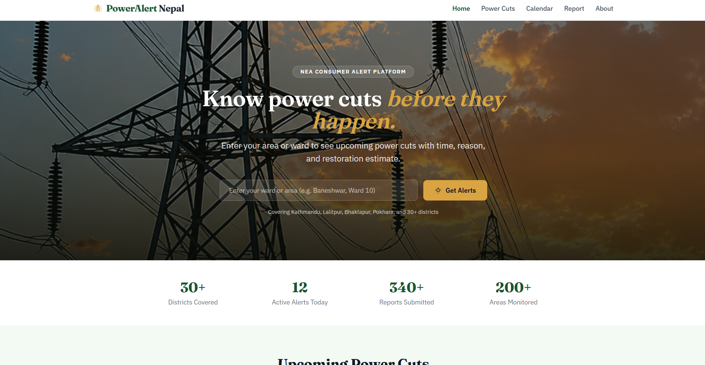
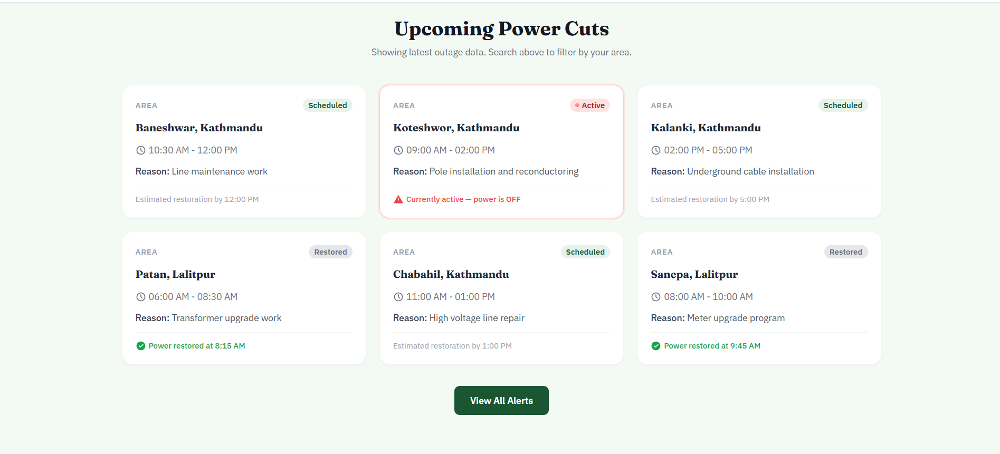
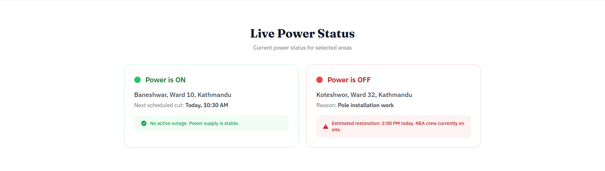

# PowerAlert Nepal

A modern, responsive web application for real-time power outage alerts, maintenance schedules, and fault reporting for Nepal Electricity Authority (NEA) consumers.

---

## Preview







## Problem Statement

Nepal Electricity Authority (NEA) serves over 3.2 million consumers but has no centralized digital platform for power cut alerts. Consumers currently depend on scattered Facebook posts, WhatsApp groups, and press releases — often finding out about outages only after their lights go off.

PowerAlert Nepal solves this by providing a single, searchable, area-based web platform where any NEA consumer can:

- Search upcoming power cuts by ward or area
- View the weekly maintenance calendar
- Check live power ON/OFF status
- Report unexpected outages directly

---

## Features

- **Area-Based Search** — Search power cuts by ward or area, dynamic card rendering
- **Color-Coded Outage Cards** — Scheduled, Active, and Restored status at a glance
- **Maintenance Calendar** — Filter by status, sort by date
- **Live Power Status** — Real-time ON/OFF display with restoration estimate
- **Fault Reporting** — Validated form with localStorage persistence, reports displayed on page
- **Contact Form** — Full email and message validation
- **Fully Responsive** — Works on mobile, tablet, and desktop

---

## Tech Stack

| Technology | Purpose |
|---|---|
| React 18 | Component-based UI |
| React Router DOM v6 | Multi-page routing and protected routes |
| Tailwind CSS v3 | Utility-first responsive styling |
| Vite | Build tool and dev server |
| Context API | Global authentication state |
| localStorage API | User auth and report persistence |
| Google Fonts | DM Sans typography |

---

## Getting Started

### Prerequisites

- Node.js v18 or higher
- npm v9 or higher

### Installation

```bash
# 1. Clone the repository
git clone https://github.com/your-username/poweralert-nepal.git

# 2. Navigate into the project folder
cd poweralert-nepal

# 3. Install dependencies
npm install

# 4. Start the development server
npm run dev
```

The app will be running at `http://localhost:5173`

### Build for Production

```bash
npm run build
```

---

## Project Structure

```
poweralert-nepal/
├── index.html
├── src/
│   ├── main.jsx              # App entry point
│   ├── App.jsx               # Routes and layout
│   ├── index.css             # Global styles
│   │   
│   ├── components/
│   │   ├── Navbar.jsx
│   │   ├── Footer.jsx
│   │   ├── OutageCard.jsx
│   │   └── ProtectedRoute.jsx
│   ├── pages/
│   │   ├── Home.jsx          # Hero, search, live status
│   │   ├── Alerts.jsx        # All outages with filter
│   │   ├── Calendar.jsx      # Maintenance calendar
│   │   ├── Report.jsx        # Fault reporting form
│   │   ├── About.jsx         # About and contact
│   │   ├── Login.jsx
│   │   └── Signup.jsx
│   └── data/
│       └── outages.js        # All mock data arrays
├── package.json
├── vite.config.js
├── tailwind.config.js
└── postcss.config.js
```

---

## Pages & Routes

| Route | Page | Access |
|---|---|---|
| `/` | Home — search and live status | Protected |
| `/alerts` | All power cut alerts | Protected |
| `/calendar` | Maintenance calendar | Protected |
| `/report` | Submit fault report | Protected |
| `/about` | About and contact | Protected |

All routes except `/login` and `/signup` require authentication. Unauthenticated users are redirected to `/login` automatically.

---
## Data Layer

All outage and maintenance data lives in `src/data/outages.js` as plain JavaScript arrays. To add new outages or maintenance records, simply add a new object to the relevant array.

```js

export const outageData = [
  {
    id: 7,
    area: "Lalitpur, Ekantakuna",
    time: "08:00 AM - 11:00 AM",
    reason: "High voltage line maintenance",
    status: "scheduled",      // "scheduled" | "active" | "restored"
    restoration: "11:00 AM",
    ward: "Ward 22",
  },
]
```

---

## Future Improvements

- Connect to a real NEA API or data feed for live outage data
- Push notification support for user-subscribed areas
- Save preferred ward/area to user profile
- SMS alerts via Sparrow SMS for non-smartphone users
- Admin dashboard for NEA staff to post updates
- Interactive Nepal map with outage overlay

---

## Learning Outcomes

- React component architecture and reusable components
- Protected routing with React Router DOM v6
- Global state management with Context API
- Dynamic content rendering with `.map()` from data arrays
- Form validation with inline error messages
- Client-side data persistence with localStorage
- Responsive design with Tailwind CSS utility classes

---

## Contributing

Pull requests are welcome. For major changes, please open an issue first to discuss what you would like to change.

1. Fork the repository
2. Create your feature branch (`git checkout -b feature/your-feature`)
3. Commit your changes (`git commit -m 'Add your feature'`)
4. Push to the branch (`git push origin feature/your-feature`)
5. Open a Pull Request

---

## Disclaimer

This is a student web development assignment project. No real NEA services are provided. All outage data shown is mock data for demonstration purposes only.

---

## License

This project is open source and available under the [MIT License](LICENSE).